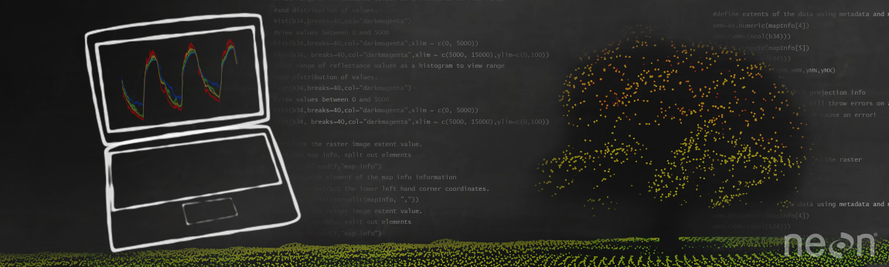

---
hide:
  - navigation
  - toc
---

# NEON Data Tutorials

Looking to improve your data skills using tools like R or Python? Want to learn more about working with a specific NEON data product? NEON develops online tutorials to help you improve your research. These self-paced tutorials are designed for you to use as standalone help on a single topic or as a series to learn new techniques.

Code for most script based tutorials can be downloaded at the end of the tutorial. Source files can also be found on [GitHub](https://github.com/NEONScience/NEON-Data-Skills). If you are interested in contributing a tutorial to this collection, please reach out using the [Contact Us form](https://www.neonscience.org/about/contact-us), and we can guide you through the process of submitting resources to the GitHub repository.

All materials are freely available for you to use and reuse. We suggest the following citation for tutorials: [AUTHOR(S), NEON (National Ecological Observatory Network)]. Data Tutorial: [TUTORIAL NAME]. [URL] (accessed [DATE OF ACCESS]). See [Citation Guidelines](https://www.neonscience.org/data-samples/guidelines-policies/citing) for examples, and for guidance in citing data and code.

---

**Remote Sensing**

- [The Basics of LiDAR (R)](R/AOP/Lidar/intro-to-lidar/basics-of-lidar/lidar-basics.md)
- [LiDAR Rasters — DSM, DTM & CHM (R)](R/AOP/Lidar/intro-to-lidar/dsm-dtm-chm/lidar-rasters-dsm-dtm-chm.md)
- [Intro to Discrete LiDAR Point Clouds (Python)](Python/AOP/Lidar/intro-lidar/intro_point_clouds_py/intro_discrete_point_clouds.md)

**Biodiversity**

- [Small Mammal Data (R)](R/biodiversity/small-mammals/MAM_Tutorial_RMD.md)
- [Aquatic Macroinvertebrates (R)](R/biodiversity/aquatic-biodiversity/01_working_with_NEON_macroinverts/01_working_with_NEON_macroinverts.md)

**Eddy Covariance**

- [Diel Cycle of Flux (R)](R/eddy-covariance/diel-cycle-flux/flux-diel-cycle.md)
- [Flux Footprint & NDVI (R)](R/eddy-covariance/footprint-NDVI/flux-footprint-NDVI.md)

**NEON API**

- [Intro to the NEON API (Python)](Python/NEON-API-python/intro_requests_py/neon_api_intro_requests_py.md)
